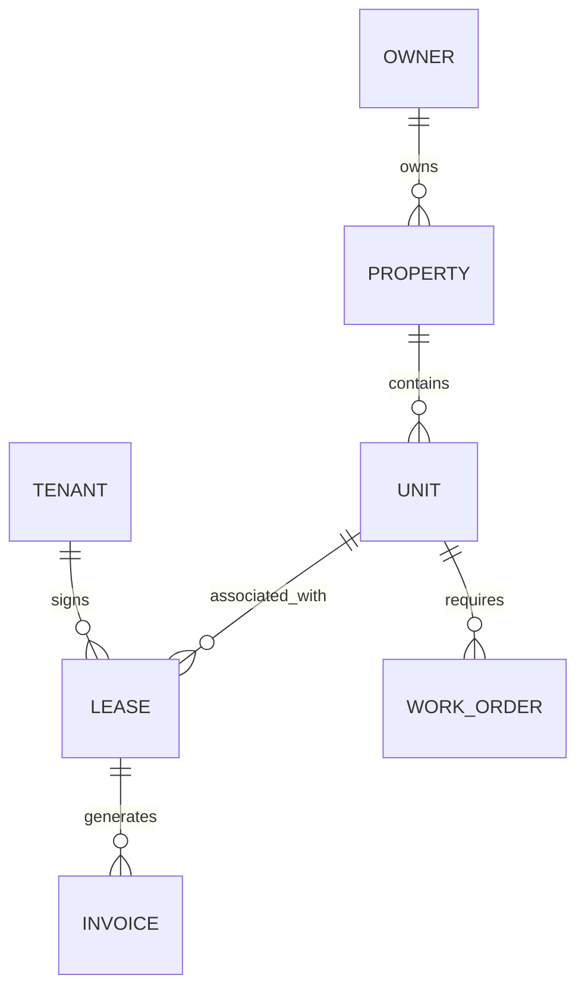

# PropNexus Enterprise: Property Management Ecosystem

## 1. Project Overview
- **Vision**: To provide a unified, high-density enterprise platform for property lifecycle management, spanning leasing, rental operations, and maintenance services.
- **Mission**: Streamline complex property workflows into a performant, multi-tenant dashboard system.
- **Target Audience**: Commercial property managers, residential REITs, service providers, and property owners.
- **Competitive Advantage**: Ultra-compact high-density UI, real-time analytics, Excel-style data management, and 8-language global support.

---

## 2. Full Feature Breakdown

### A. Lease Management Module
- **Tenant Onboarding**: Digital lease signing, KYC/identity verification.
- **Lease Lifecycle**: Renewal tracking, escalation clauses, termination workflows.
- **Document Vault**: Centralized storage for contracts, addendums, and insurance.

### B. Rental Operations Module
- **Rent Collection**: Automated invoicing, payment tracking, late fee calculation.
- **Occupancy Analytics**: Real-time vacancy rates, unit-by-unit history.
- **Financial Reporting**: P&L per property, tax-ready exports.

### C. Service & Owner Portal
- **Work Order Management**: Service requests, contractor dispatch, photo proof of completion.
- **Owner Dashboard**: Net distribution views, maintenance expense breakdown.
- **Asset Maintenance**: Preventive maintenance schedules for HVAC, elevators, etc.

---

## 3. Technical Architecture
- **Architecture Style**: Monorepo (Turborepo) with shared UI library and 3 Vite-based Frontend Apps.
- **State Management**: TanStack Query (Server State) + Zustand (UI State).
- **Styling**: Tailwind CSS + CSS Variables for Multi-App Theming.
- **Data Layer**: TanStack Table v8 (Excel-style frozen columns/resizing).
- **Communication**: REST API (Node.js/Express) + WebSockets for real-time notifications.

---

## 4. Recommended Tech Stack
- **Frontend Framework**: React 19 + Vite.
- **Shared UI Library**: Custom Design System (Buttons, Inputs, Modals, Tooltips via Floating UI).
- **Backend Framework**: Node.js (TypeScript) + Express or NestJS.
- **Database**: PostgreSQL.
- **ORM**: Prisma.
- **Localization**: react-i18next (Supporting EN, ES, FR, RU, ZH, JA, AM, HE).
- **Authentication**: Auth.js (NextAuth) or Clerk for enterprise SSO.

---

## 5. Database Design

- **Indexing Strategy**: B-Tree indices on `PropertyId`, `TenantEmail`, and `LeaseStatus`.
- **Multi-tenancy**: Strict `OrganizationId` scoping on every table.

---

## 6. API Design
- **Structure**: RESTful with JSON:API standards.
- **Rate Limiting**: Tiered based on Organization plan.
- **Logging**: Full request/response logging for financial transparency.

---

## 7. Frontend System Design
- **Folder Structure**: Follows the `apps/` and `packages/` monorepo pattern.
- **Design System**: Consumes `uiConfig.js` for unified density (h-6, h-7, h-8 sizes).
- **Theme System**: CSS Variables for branding (Lease = Blue, Rent = Green, Service = Amber).

---

## 8. Authentication & Security
- **RBAC**: Fine-grained permissions (e.g., `leases.read`, `leases.write`).
- **Encryption**: AES-256 for document storage.
- **Compliance**: GDPR and SOC2 readiness built-in.

---

## 9. Performance Optimization
- **Table Virtualization**: Using `@tanstack/react-virtual` for 10,000+ row lists.
- **Code Splitting**: Dynamic imports for heavy analytics modules.
- **Caching**: 5-minute SWR caching for property lists.

---

## 10. Development Roadmap
- **Sprint 1**: Infrastructure & Shared UI (The "Pattern").
- **Sprint 2**: Lease Management Core & Tenant Portal.
- **Sprint 3**: Rent Engine & Financial Reporting.
- **Sprint 4**: Service & Maintenance Integration.

---

## 11. Final Engineering Instructions for Cursor AI
- **Rule 1**: Strictly adhere to the `UI_CONFIG` constants for all dimensions to maintain enterprise density.
- **Rule 2**: Use the `DataTable.jsx` pattern for all data-heavy views, ensuring column pinning is available.
- **Rule 3**: Implement Tooltips on all icons and action buttons to improve UX in compact views.
- **Rule 4**: All business logic must be in `services/` and UI logic in `components/`.
- **Rule 5**: Use `react-i18next` for every piece of user-facing text.
